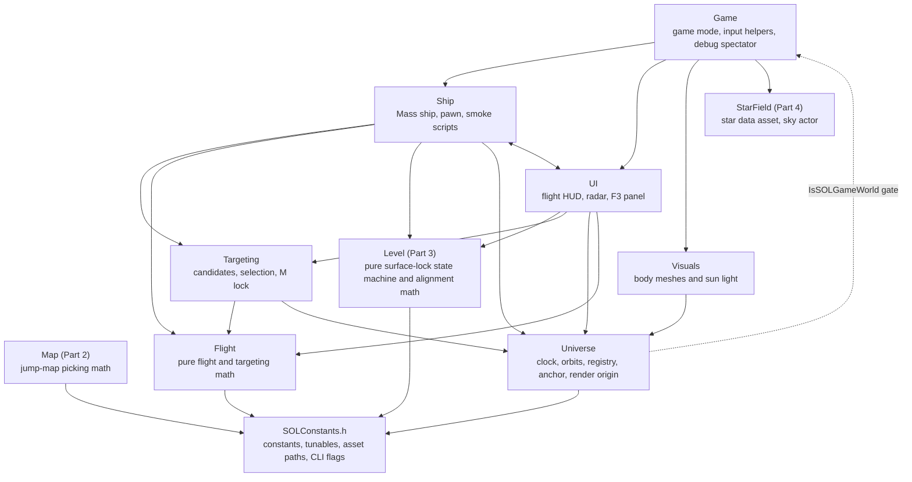
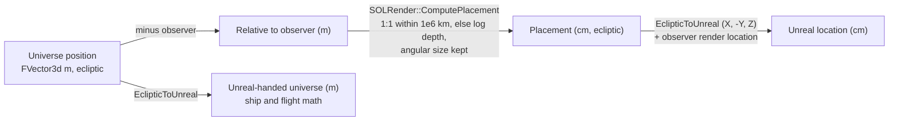
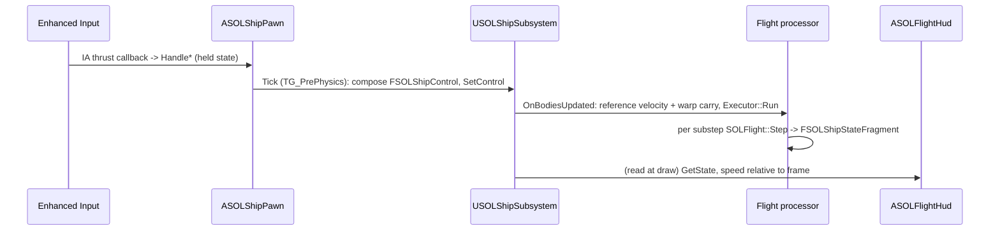

<!-- SOLTest / Copyright © 2026 Acid Rain Studios LLC -->

# SOLTest architecture

A high-level map of how the game's systems fit together: modules, the per-frame update order, coordinate frames, key types and the main data flows. It is a living reference, not a design record. The *why* behind each decision lives in the SDDs ([`SDDs/1-solar-system-architecture.md`](SDDs/1-solar-system-architecture.md) for the cross-cutting decisions, [`SDDs/2-foundations-flight-scaffold.md`](SDDs/2-foundations-flight-scaffold.md) section 3 for what Part 1 actually built, [`SDDs/3-jump-map.md`](SDDs/3-jump-map.md) for Part 2, [`SDDs/4-surface-lock.md`](SDDs/4-surface-lock.md) for Part 3). Exact numbers and bindings are in [`GAME_MECHANICS.md`](GAME_MECHANICS.md).

**Status:** Part 1 (foundations, ship flight, HUD) and Part 2 (jump map) are complete. Part 3 (surface-lock) is built: the pure logic (`Level/SOLSurfaceLock`, 3a) and its engine integration (3b: the `L` key, `USOLShipSubsystem` stepping the lock state, the flight processor applying the alignment per substep, the HUD status/hint line, and the jump clearing the lock). Part 4 (star field) is built: the offline bake and import (`Tools/StarField/`, 4a/4b) and the runtime sky actor `ASOLStarField` (4c).

---

## 1. Overview

SOLTest is a 1:1-scale solar-system space sim: the player flies a small ship in third person among the Sun, eight planets, five dwarf planets and their major moons on real Keplerian orbits, with a sim clock and time-warp, gravity, a reference-frame/target system and a sim-style HUD. The core architectural bet has three parts:

1. **Double-precision universe coordinates.** Every authoritative position is an `FVector3d` in meters in a right-handed ecliptic frame, far beyond what Unreal's world can hold.
2. **Observer-relative rendering.** Unreal's world is only a render view. A render origin near the observer maps to Unreal (0,0,0), and every body is re-placed from universe coordinates each frame. Far bodies are depth-compressed with their angular size preserved.
3. **MassEntity for scale.** The ship is a Mass entity stepped by a Mass processor. The Pawn is a thin input and camera proxy. The same pattern is meant to extend to NPC ships, asteroids and projectiles, with ~1M entities as the goal.

Throughout the code, the rule is **pure logic in plain C++, engine glue in thin UObjects** (see [section 7](#7-testing-architecture)).

---

## 2. Module map

All code is in the single game module `Source/SOLTest/`, organized by feature folder (`Docs/STYLE_GUIDE.md` §14.2). Arrows point from a module to what it depends on.



`Ship` and `UI` depend on each other: the pawn opens the F3 panel and forwards radar zoom keys to the HUD, and the HUD reads the pawn's joystick and camera state. The Universe subsystems ask `ASOLGameMode::IsSOLGameWorld` whether to exist at all. Every module includes `SOLConstants.h`. Only the pure leaves are drawn above.

| Folder | Responsibility | Key files |
|---|---|---|
| `Universe/` | Sim clock, Kepler orbits, body registry, anchor selection, render origin and far placement, and the subsystem that drives the frame | `SOLAnchorSubsystem`, `SOLBodyRegistry(Subsystem)`, `SOLSimClock(Subsystem)`, `SOLKepler`, `SOLRenderOrigin`, `SOLRenderPlacement`, `SOLBodyFrameCache` |
| `Flight/` | Pure flight model, gravity, collision, warp carry, and target-picking math | `SOLFlight`, `SOLTargeting` |
| `Ship/` | Player ship as a Mass entity, its processor and subsystem (including the surface-lock state and its per-substep alignment), the Pawn proxy, scripted smoke tests | `SOLShipSubsystem`, `SOLShipFlightProcessor`, `SOLShipFragments`, `SOLShipPawn`, `SOLShipSmokeFlight`, `SOLShipSmokeInput`, `SOLSurfaceLockSmoke` |
| `Targeting/` | Target candidates, selection, the M frame lock, reference velocity | `SOLTargetingSubsystem`, `SOLTargetable` |
| `UI/` | Canvas flight HUD, radar, orbit lines, F3 speed panel, and their pure layout and format math | `SOLFlightHud`, `SOLSpeedPanelWidget`, `SOLRadarLayout`, `SOLOrbitLines`, `SOLHudFormat`, `SOLSpeedStepper`, `SOLHudSmoke` |
| `Visuals/` | Places body meshes each frame and sets their per-body sun direction | `SOLBodyVisuals` |
| `StarField/` | Star field (Part 4, issue #5): the baked star data asset (4b) and the runtime sky actor (4c) that draws the bright-star sprites and the faint-star cubemap sphere. Content is produced offline by `Tools/StarField/` (bake, then `import_star_field.py`, then `create_star_field_materials.py`) | `SOLStarFieldData`, `SOLStarField` |
| `Map/` | Jump map (Part 2): picking, orbit-camera and warp-curve math, the map mode and its camera, the jump sequence, the smoke scripts | `SOLMapPicking`, `SOLMapCamera`, `SOLWarpCurve`, `SOLMapModeSubsystem`, `SOLJumpSubsystem`, `SOLMapSmoke`, `SOLMapPickSmoke`, `SOLJumpSmoke` |
| `Level/` | Surface-lock (Part 3) pure logic: the engage/warn/release state machine and the up-alignment math. Its engine integration lives in `Ship/`, `Targeting/` and `UI/` (no new subsystem) | `SOLSurfaceLock` |
| `Game/` | Game mode (default pawn and HUD, spawns the body visuals and the star field, smoke screenshot), shared Enhanced Input helpers, debug spectator | `SOLGameMode`, `SOLInputHelpers`, `SOLSpectatorPawn` |
| root | Module boilerplate, log category, central constants | `SOLTest.h/.cpp`, `SOLConstants.h`, `SOLTest.Build.cs` |

---

## 3. Frame update order

The whole universe is advanced by **one tickable world subsystem, `USOLAnchorSubsystem::Tick`**, which ticks after `TG_PostPhysics`. The clock, registry and targeting subsystems do not tick themselves. The ship's Mass processor is **not** registered with a Mass processing phase. Instead, `USOLShipSubsystem` runs it explicitly from the anchor's `OnBodiesUpdated` event, so the ship always steps against this frame's bodies.

```mermaid
sequenceDiagram
    autonumber
    participant Pawn as ASOLShipPawn (TG_PrePhysics)
    participant Anchor as USOLAnchorSubsystem::Tick
    participant Clock as USOLSimClockSubsystem
    participant Reg as USOLBodyRegistrySubsystem
    participant Ship as USOLShipSubsystem
    participant Tgt as USOLTargetingSubsystem
    participant Proc as USOLShipFlightProcessor
    participant Vis as ASOLBodyVisuals / pawn
    participant HUD as ASOLFlightHud::DrawHUD

    Pawn->>Ship: SetControl(composed input)
    Note over Anchor: dt = min(realDelta, MAX_FRAME_DELTA_S)
    Anchor->>Clock: AdvanceFrame(dt) (sim time += dt x warp)
    Anchor->>Reg: UpdateFromClock() (Kepler positions, then refresh Unreal-handed FSOLBodyFrameCache)
    Anchor->>Ship: OnBodiesUpdated(dt)
    Ship->>Tgt: RefreshCandidates(), GetReferenceVelocityMps()
    Ship->>Ship: ComputeFrameInputs (warp carry, previous body positions)
    Ship->>Proc: Executor::Run (substeps: gravity, SOLFlight::Step, swept collision, surface-lock alignment)
    Ship->>Ship: UpdateSurfaceLock (state machine on this frame's ship and bodies; engaging calls Tgt LockToBodyIndex)
    Ship->>Anchor: SyncObserverPositionM(ship position)
    Anchor->>Anchor: anchor selector update (25% hysteresis), RebaseRenderOrigin
    Anchor->>Vis: OnUniverseUpdated (place bodies, pawn follows ship)
    Note over HUD: after the world tick, at draw time
    HUD->>HUD: read subsystems, draw reticle, markers, bracket, radar, text
```

**Why the order matters.** Each stage consumes the output of the previous one *from the same frame*. The ship needs this frame's bodies for gravity and collision, and this frame's reference velocity (so targeting is refreshed first). The anchor and rebase need this frame's ship position. The visuals and HUD need the final render origin. If the processor were phase-registered, the ship would step against last frame's bodies and the anchor would lag it by one frame.

- **Time-warp frame carry:** ship flight always runs in real time, so each frame the ship also inherits the part of its reference frame's motion that warp adds beyond real time (`SOLFlight::FrameCarryDisplacement`, for both position and velocity). This keeps the ship co-moving with Earth at 1 d/s.
- **Surface-lock timing:** the lock state is advanced after the flight run, when the ship and the bodies are both at this frame's positions (before the run the ship is one body-step behind, which misreads altitude by up to the body's speed times the frame time). Its decision (the body to align to, the frame lock) takes effect from the next step; the alignment itself runs inside the processor per substep with the substep's real dt.
- **Hitch budget:** the real delta is clamped once to `SOL::MAX_FRAME_DELTA_S` (0.5 s) and fed to both the clock and the ship. It is split into at most `SHIP_MAX_SUBSTEPS` (16) substeps of 1/30 s, which cover that budget exactly (a `static_assert` enforces this), so a hitch slows the universe uniformly and no ship time is dropped.

To change this order, update this section, SDD 2 section 3, and the tick comments in `SOLAnchorSubsystem.cpp` together.

---

## 4. Coordinate systems and conversions

| Frame | Handedness and units | Used by |
|---|---|---|
| **Universe (ecliptic)** | Right-handed J2000 ecliptic (+X vernal equinox, +Z north ecliptic pole), meters, double, Sun at origin | Body registry, anchor, observer, map picking |
| **Unreal-handed universe** | Ecliptic with Y negated (`EclipticToUnreal`), meters, double | Ship state, flight math, targeting candidates, body frame cache. `FQuat4d` works as in Unreal (X forward, Y right, Z up) |
| **Unreal render** | Left-handed, centimeters, relative to `FSOLRenderOrigin::OriginM` (within 10 km of the observer) | Actor locations, HUD projection |



"Observer" in the pipeline above is really the **render viewpoint**: the observer (ship) normally, or the jump-map camera while the map is open (`USOLAnchorSubsystem::SetViewpointOverrideM`). Anchor selection always uses the observer. The render origin snaps to the viewpoint when the anchor body changes, when the override is cleared, or when the viewpoint drifts `SOL::RENDER_REBASE_DISTANCE_M` (10 km) from it. Unreal's own `SetNewWorldOrigin` is deliberately not used: its int32 cm origin is too small for AU-scale distances. Beyond `SOL::DEFAULT_MAX_RENDER_DISTANCE_CM`, depth is compressed as `d' = Max * (1 + 0.1 * ln(d / Max))` and the radius is scaled by `d'/d`, which keeps depth order and angular size (SDD 2 Amendment 1). Positions stay `FVector3d` until the final conversion to `FVector`.

---

## 5. Key types per module

Each type is marked **pure** (plain C++, unit-tested without a world) or **engine** (UObject, Actor, subsystem or Mass type, covered by smoke checks).

**Universe** (`Source/SOLTest/Universe/`)
- `FSOLSimClock` (pure, `SOLSimClock.h`): Julian date and the warp ladder. `USOLSimClockSubsystem` (engine) wraps it.
- `FSOLKeplerElements` / `FSOLSecularElements` / `SOLKepler` (pure, `SOLKepler.h`): JPL secular elements and the Kepler solver that turns them into a state.
- `FSOLBodyRegistry` (pure, `SOLBodyRegistry.h`): structure-of-arrays bodies (name, radius, GM, **parent index**, elements, Sun-frame position and velocity, and — issue #12 — sidereal rotation period/axial tilt/W0 with a computed orientation via `GetOrientation`). `SOLBodyRotation` (pure, `SOLBodyRotation.h`): the tilt-plus-spin quaternion math `Update()` calls per body. `USOLBodyRegistrySubsystem` (engine) owns the registry plus the Unreal-handed `FSOLBodyFrameCache` (positions only as of #12; visuals convert orientation separately via `SOLRender::EclipticToUnreal(FQuat4d)`).
- `FSOLAnchorSelector` (pure, `SOLAnchor.h`): picks the nearest body with 25% hysteresis.
- `FSOLRenderOrigin` / `SOLRender::ComputePlacement` (pure, `SOLRenderOrigin.h`, `SOLRenderPlacement.h`): rebasing and far-placement math.
- `USOLAnchorSubsystem` (engine, `SOLAnchorSubsystem.h`): the frame driver. It holds the observer position and the render origin, and exposes `OnBodiesUpdated`, `OnUniverseUpdated` and `OnRenderOriginShifted`.

**Flight** (`Source/SOLTest/Flight/`)
- `FSOLShipState`, `FSOLShipControl`, `FSOLFlightParams` (pure, `SOLFlight.h`): the ship's state, input and tuning.
- `SOLFlight` (pure): `Step` (assist or Newtonian, quaternion rotation), `GravityAcceleration`, swept sphere collision, `FrameCarryDisplacement`, `BodyPositionAtSubstep`, `MakeCircularOrbitState`.
- `FSOLTargetInfo` / `SOLTargeting` (pure, `SOLTargeting.h`): `PickUnderReticle`, `Cycle`, `ResolveReferenceVelocity`.

**Ship** (`Source/SOLTest/Ship/`)
- `FSOLShipStateFragment`, `FSOLShipControlFragment`, `FSOLShipParamsFragment` (const shared), `FSOLPlayerShipTag` (engine, `SOLShipFragments.h`): the Mass data for the ship.
- `USOLShipFlightProcessor` (engine, `SOLShipFlightProcessor.h`): the substepped gravity, flight, collision and surface-lock alignment loop (`FSOLShipControlFragment::AlignBodyIndex` names the body per ship), with a parallel chunk loop that allocates nothing per run.
- `USOLShipSubsystem` (engine, `SOLShipSubsystem.h`): spawns the entity, runs the processor on `OnBodiesUpdated`, computes the warp carry, owns and steps the player's `FSOLSurfaceLockState` (L presses arrive via `RequestSurfaceLockToggle`; `ClearSurfaceLock` for a jump), syncs the observer, fires `OnShipsStepped` after each step, and is the Pawn's API (`SetControl`, `GetState`, `SetState` and so on).
- `ASOLShipPawn` (engine, `SOLShipPawn.h`): Enhanced Input (created in C++), virtual joystick, chase camera, placeholder mesh. It carries no universe coordinates.
- `FSOLShipSmokeFlight` / `FSOLShipSmokeInput` / `FSOLSurfaceLockSmoke` (engine test scripts): the `-SOLSmokeFlight`, `-SOLSmokeInput` and `-SOLSmokeLevel` runs.

**Targeting** (`Source/SOLTest/Targeting/`)
- `ISOLTargetable` (engine interface, `SOLTargetable.h`): for non-body targets. It returns an `FSOLTargetInfo` each frame.
- `USOLTargetingSubsystem` (engine, `SOLTargetingSubsystem.h`): the candidate list (registry bodies at their body index, then registered targetables), the selection, the M lock (also set by surface-lock through `LockToBodyIndex`) and the reference velocity.

**UI** (`Source/SOLTest/UI/`)
- `ASOLFlightHud` (engine, `SOLFlightHud.h`): everything drawn in `DrawHUD` with its own pinhole projection. It does not tick.
- `USOLSpeedPanelWidget` (engine, `SOLSpeedPanelWidget.h`): the F3 UMG panel, built in C++.
- `SOLRadar` / `FSOLRadarContact` (pure, `SOLRadarLayout.h`): radar projection, floor and zoom.
- `SOLHudFormat`, `SOLSpeedStepper`, `SOLOrbitLines` (pure): unit and distance formatting, odometer stepping, ellipse sampling.
- `FSOLHudSmoke` (engine test script, `SOLHudSmoke.h`): the `-SOLSmokeHud` run.

**Visuals** (`Source/SOLTest/Visuals/`)
- `ASOLBodyVisuals` (engine, `SOLBodyVisuals.h`): one sphere mesh and material instance per body, re-placed on `OnUniverseUpdated`, with `SunDirection` set per body and — issue #12 — its world rotation set each update from `SOLRender::EclipticToUnreal(registry.GetOrientation(index))`, so every body spins visibly on its real axial tilt. `SOLBodyAppearance::FindBaseColor` exposes each body's base color so the map icons match the meshes.

**StarField** (`Source/SOLTest/StarField/`, Part 4)
- `FSOLBrightStar` / `USOLStarFieldData` (engine data asset, `SOLStarFieldData.h`): the bright-star (V < 8) list, brightest first (ecliptic unit direction, V, flux relative to mag 8, luminance-1 linear color), plus the cube texel solid angle that converts sprite flux to the faint-star cubemap's radiance units and the CC BY-SA attribution. No logic; written only by `Tools/StarField/import_star_field.py` into `/Game/SOL/StarField/DA_SOLStarField` next to the `T_SOLStarFieldCube` TextureCube (paths in `SOL::Paths`).
- `ASOLStarField` (engine actor, `SOLStarField.h`, 4c): spawned by `ASOLGameMode` next to `ASOLBodyVisuals`. It doesn't tick, binds no events, and never moves after `BeginPlay`. `BeginPlay` fills one `UInstancedStaticMeshComponent` once: 45,653 quads at `STAR_FIELD_SPRITE_RADIUS_CM` (2e12 cm), each turned to face the center, with custom data = flux × color and material `M_SOLStarSprite`. It also sets up a two-sided sphere of radius `STAR_FIELD_SKY_RADIUS_CM` (4e12 cm, inside `HALF_WORLD_MAX`) that samples the cube along the view direction (`M_SOLStarSky`). Both components use absolute transforms pinned at the Unreal origin. Moving the 45k-instance ISM cost ~4 ms of game thread per frame, and the sky gains nothing from moving. The render-origin rebase keeps the camera within ~10 km of the origin, which is a ≤5e-7 rad error. Keep `RENDER_REBASE_DISTANCE_M` small (SDD 5 §3.2). Nothing rotates: the directions are already ecliptic, converted once with `SOLRender::EclipticToUnreal`. The sprites use a very low translucency sort priority, so later world-space translucency draws over them.

**Map** (`Source/SOLTest/Map/`, Part 2)
- `FSOLMapPickState` / `SOLMapPicking` (pure, `SOLMapPicking.h`): ray-plane intersection, planar decomposition, destination composition, body picking under a ray.
- `FSOLOrbitCameraState` / `SOLMapCamera` (pure, `SOLMapCamera.h`): orbit-camera position, look-at orientation, orbit, ground-plane pan and log zoom.
- `USOLMapModeSubsystem` (engine, `SOLMapModeSubsystem.h`): the open map's orbit state, its `ACameraActor` view target, and the anchor's render-viewpoint override (set on `OnBodiesUpdated` before the rebase; the camera is placed on `OnUniverseUpdated`). The ship pawn owns J/Esc, the `IMC_Map` mapping and the cursor, and forwards drags and wheel notches. Destination picking lives here too (pick state recomputed on `OnUniverseUpdated`).
- `USOLJumpSubsystem` (engine, `SOLJumpSubsystem.h`): the jump's warp sequence. Enter makes the pawn hand it the pick and close the map; its real-time clock advances on `USOLShipSubsystem::OnShipsStepped` (end of the ship step, before the anchor update), and at 3 s it teleports the ship through `SetState` (which re-anchors and force-snaps the render origin). The pawn drives the camera FOV and post-process from the clock; the HUD draws the streaks instead of the flight HUD.
- `FSOLBodyLodParams` / `SOLMapBodyLod` (pure, `SOLMapBodyLod.h`): apparent diameter in pixels and the mesh/icon cross-fade alpha.
- `SOLMapPickRadius` (pure, `SOLMapPickRadius.h`): `ComputeMapPickRadiusM`, a body's pick radius that never drops below a minimum on-screen size.
- `FSOLMapBodyOverlay` (engine, `SOLMapBodyOverlay.h`): owned and drawn by `ASOLFlightHud` while the map is open. It evaluates each body's LOD from the map camera and draws its icon disc (one translucent Canvas triangle batch, in the body's material base color from `SOLBodyAppearance::FindBaseColor` in `Visuals/`) and a decluttered name label, and keeps each body's pick radius for the frame.
- `FSOLMapSmoke` (engine test script, `SOLMapSmoke.h`): the `-SOLSmokeMap` run.
- `FSOLMapPickSmoke` and `FSOLJumpSmoke` (engine test scripts): the `-SOLSmokeMapPick` and `-SOLSmokeJump` runs.

**Level** (`Source/SOLTest/Level/`, Part 3)
- `FSOLSurfaceLockParams` / `FSOLSurfaceLockState` / `SOLSurfaceLock` (pure, `SOLSurfaceLock.h`): `UpdateSurfaceLockState` (the auto/manual engage-warn-release state machine, with a suppression latch so a manual release can't be immediately overridden by auto-engage), `TargetUpDir` and `ApplyAlignmentCorrection` (a minimal shortest-arc rotation of the ship's whole orientation toward "up = away from the locked body," not a roll-only correction, so there is no attitude-dependent singularity). Called by `USOLShipSubsystem` (state machine, once per step), `USOLShipFlightProcessor` (alignment, per substep) and `ASOLFlightHud` (`ComputeManualRangeM` for the hint line).

**Game** (`Source/SOLTest/Game/`)
- `ASOLGameMode` (engine, `SOLGameMode.h`): default pawn (ship, or spectator with `-SOLSpectator`) and HUD, spawns `ASOLBodyVisuals` and `ASOLStarField`, runs `-SOLSmokeShot`, and provides `IsSOLGameWorld`, which gates all the SOL subsystems.
- `SOLInputHelpers` (engine, `SOLInputHelpers.h`): shared helpers that create Enhanced Input actions and mappings in C++.
- `ASOLSpectatorPawn` (engine, `SOLSpectatorPawn.h`): a debug free-fly camera that rides the ship with `-SOLSpectator`.

---

## 6. Data flow narratives

### 6.1 Player presses W



Later in the same frame, the observer sync and `OnUniverseUpdated` move the pawn to the ship's render location. The HUD then shows the speed relative to the active frame, with the Sun-frame speed beneath it.

### 6.2 M pressed with Mars selected

1. The pawn's M callback calls `USOLTargetingSubsystem::ToggleFrameLock()`, which locks Mars's candidate index (or the anchor if nothing is selected).
2. On the next `OnBodiesUpdated`, `RefreshCandidates()` rebuilds Mars's `FSOLTargetInfo` from the body cache, and `SOLTargeting::ResolveReferenceVelocity` returns Mars's velocity.
3. `USOLShipSubsystem` writes it into `Control.ReferenceVelocityMps` and uses Mars (`GetReferenceIndex`) for the warp carry. Assist now brakes toward Mars's velocity, and the speed cap is relative to Mars.
4. The lock persists through anchor and selection changes until M is pressed again.

### 6.3 Radar draw

1. `DrawHUD` rebuilds its reused `FSOLRadarContact` array from the targeting candidates, transforming each one into ship-local axes (X forward, Y right, Z up) through the ship orientation.
2. The range is `SOLRadar::EffectiveFloorM(bHasSelectedTarget)` in AUTO mode (10,000 km, or 1 km with a target). In MANUAL mode (`-` / `=`) it is the stepped range, reclamped to between the floor and 1 AU.
3. `SOLRadar::ProjectContact` maps each contact to a disc offset and a height stalk (whole-vector scaling onto the range sphere, with a collapse law near the center). The HUD draws the result on a tilted disc with the selected target highlighted.

---

## 7. Testing architecture

The project splits **pure logic** from **engine glue**. The math that decides behavior (orbits, clock, anchor, render placement, flight, targeting, radar, formatting, map picking) lives in plain C++ namespaces and structs and is unit-tested with the UE Automation Framework (`Source/SOLTest/Tests/<Topic>Test.cpp`, `SOLTest.<Topic>.<Case>`). Tests are written test-first by a separate subagent from each SDD's API appendix. The UObject, Actor and Mass glue is listed in each SDD's "Non-unit-tested pieces" section and verified with PIE smoke checks and the scripted command-line runs below, which log a PASS or FAIL per check to `LogSOL` and then quit. For rules and the runner (`Tools\RunTests.bat`), see [`CLAUDE.md` → Testing](../CLAUDE.md#testing).

| Flag | Owner | Exercises |
|---|---|---|
| `-SOLSmokeShot=<s>` | `ASOLGameMode` | Takes a screenshot after N seconds, then quits (visual check of any state) |
| `-SOLSmokeFlight` | `FSOLShipSmokeFlight` | Pawn-less scripted flight: hover, assisted cruise, Newtonian thrust and coast, pitch, braking, Earth impact, then 1 d/s warp co-motion, collision and surface rest under warp |
| `-SOLSmokeInput` | `FSOLShipSmokeInput` | Simulated key, mouse and wheel events through the real mapping context and callbacks (thrust, stick, targeting, M lock, warp), with a screenshot |
| `-SOLSmokeHud` | `FSOLHudSmoke` | HUD toggles and radar zoom via game keys, and the F3 panel via Slate key events to the focused widget |
| `-SOLSmokeMap` | `FSOLMapSmoke` | Jump map via injected events: J open (cursor, ship input suspended, map camera, render viewpoint), orbit/zoom/pan drags, J and Esc close, with screenshots; body icon/label state checked at 1e13 m, ~9e10 m, ~8e8 m (Earth cross-fade) and ~5e7 m (mesh only) |
| `-SOLSmokeMapPick` | `FSOLMapPickSmoke` | Destination pick via injected events: body and empty-space references, planar drag/lock, Shift height preview/lock, X clear, OS-cursor sync after a drag, close/reopen clears; screenshots of the disc, guide line and marker |
| `-SOLSmokeJump` | `FSOLJumpSmoke` | Pick on Mars and jump: Enter with no pick ignored, warp start, midpoint FOV/post-process on the warp curve with the HUD hidden, arrival position/velocity/orientation/anchor/origin, restore; mid-warp and arrival screenshots |
| `-SOLSmokeLevel` | `FSOLSurfaceLockSmoke` | Surface-lock via injected L presses and scripted teleports above Earth: L out of range ignored, auto-engage with frame match (replacing an M lock on another candidate) and alignment (time constant checked one tau in), L release that stays released (suppression latch) and stops aligning, latch cleared by a climb, auto warn/release (alignment stops), hint, manual engage/warn/release, a scripted jump that drops an L pressed during the warp and releases the lock on arrival; screenshots of each HUD line |
| `-SOLSpectator` | `ASOLGameMode` / `ASOLSpectatorPawn` | Debug free-fly camera riding the ship instead of the pawn |
| `-SOLStart=<Body>`, `-SOLAltitudeKm=<km>`, `-SOLLookAt=<Body>` | Ship subsystem / spectator | Spawn body and altitude, and the debug camera's look target, for any of the runs above |

All flag strings live in `SOL::CommandLine` in `SOLConstants.h`.

---

## 8. Extension points for future parts

These are grounded in SDD 1, SDD 2 and the roadmap ([`Plans/1-solar-system-architecture-plan.md`](Plans/1-solar-system-architecture-plan.md)). Each part's own SDD settles the details.

- **Part 2 (jump map):** `SOLMapPicking` produces a universe-frame destination; `USOLJumpSubsystem` executes the jump through `USOLShipSubsystem::SetState` (a teleport that refreshes targeting and force-snaps the render origin). Listeners that must run after the ship step bind to `OnShipsStepped`, not beside it on `OnBodiesUpdated`. Native `TMulticastDelegate` broadcasts iterate in reverse of the *current* bind order, but any unbind compacts the list with `RemoveAtSwap`, so that order is not a durable guarantee and nothing should rely on relative bind or fire order for correctness. `OnShipsStepped` fires after the flight processor's step because of *where* it is broadcast (after `UE::Mass::Executor::Run` returns in `StepShips`), not because of delegate ordering. On arrival the jump clears the selected target, the M frame lock and any surface-lock (with its suppression latch) before the teleport, and it aborts the warp if a frame's universe update runs without a ship step.
- **Part 5 (moons, asteroids, rings):** `FSOLBodyDef::ParentIndex` already chains a child's orbit to its parent (parent GM, positions summed), so moons are more registry entries. Asteroids and ring particles are Keplerian too but are planned as Mass entities, not registry bodies. The collision broadphase is an O(bodies) reject per substep, and a spatial structure is deferred until body counts grow.
- **Part 6 (weapons, targets):** dropped targets and enemies implement `ISOLTargetable` and register with `USOLTargetingSubsystem`, which makes them selectable, M-lockable and visible on the radar with no HUD changes. Bolts are planned as data-driven arrays with swept traces, rendered through Niagara, not Actors.
- **Part 10 (scale demo):** NPC ships reuse the ship archetype (state and control fragments, a const shared params fragment per ship class) and the parallel `USOLShipFlightProcessor`. `FSOLPlayerShipTag` is what separates the player's entity from other ships.
- **Pawn/entity bridge:** any new controllable entity follows the same pattern: a thin Actor writes control state into the entity through a subsystem, and reads its state back once per `OnUniverseUpdated`.

---

## Keeping this document in sync

Like [`GAME_MECHANICS.md`](GAME_MECHANICS.md), this file must stay truthful. Update it in the same change whenever:

- a new feature folder, subsystem, Mass processor, Actor or widget is added, or one is removed (sections 2 and 5);
- a class's responsibility or a module dependency changes (sections 2 and 5);
- the frame update order, the tick driver, or the hitch/substep/warp-carry rules change (section 3, together with SDD 2 section 3);
- a coordinate frame or conversion changes (section 4);
- a `-SOL*` command-line flag is added or changes behavior (section 7).

Keep it high level. Put exact values in `GAME_MECHANICS.md` and rationale in the SDDs, and link to them instead of copying.
